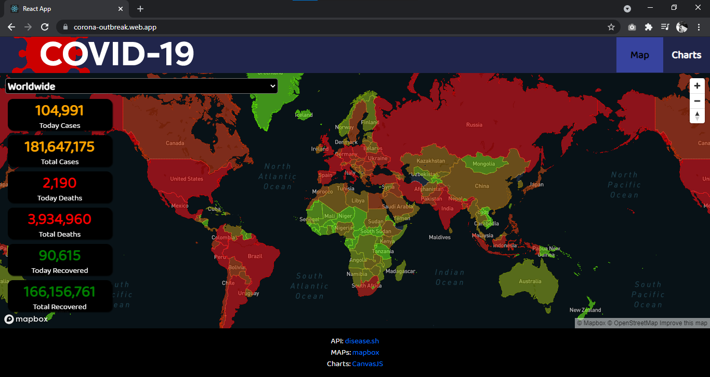
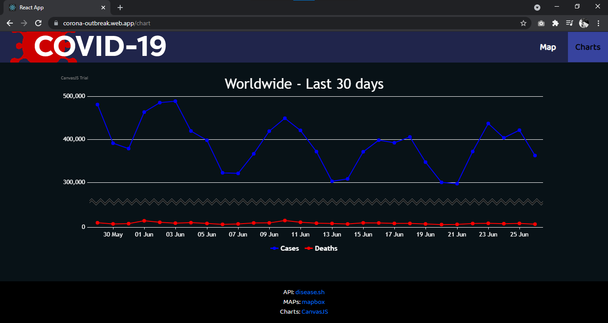
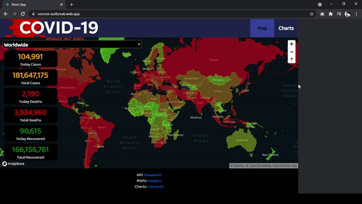
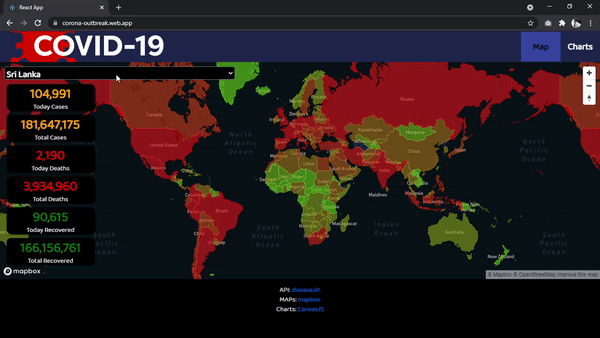
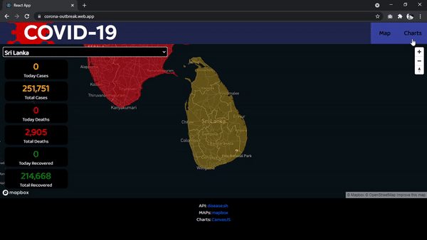

# COVID19 TRACKER

#### Live : https://corona-outbreak.web.app/

## CS50

> This was my final project for conclude the CS50 Introduction to Computer Sciense course.

> C, python, SQL, HTML, CSS, JavaScript, Flask

## Features

- [ReactJS](https://reactjs.org/)
- [Disease API](https://disease.sh/docs/)
- [React-Map-GL](https://visgl.github.io/react-map-gl/)
- [Mapbox Geocoding API](https://docs.mapbox.com/api/search/geocoding/)
- [React Boostrap](https://react-bootstrap.github.io/)

## Explaining the project and features used

Covid19 tracker was built using ReactJS which is a popular javascript library. I choose it because
its idea of Components realy make it easier to build more complex applications. We can focus on
small parts of the application at a time. Also it has lots of packages built by other users.

The idea of this project is simply to show the current covid19 situtation in the world to the people in an understandable manner. the data is comming from https://disease.sh API. There are lots of APIs out there but some of them are lacking some features like historical data and some of them are not updated in a while or not updating regularly. disease.sh had the perfect structure i wanted and it is updating in every few hours.

### Map:

For the maps i choose mapbox. i doubt it is the best solution, but it has lots of features and customizations. React has lots of mapbox packages. i choose mapbox-gl as it seems to be the most popular one. LeafletJS is another library i could use instead of mapbox it is also using mapbox api under the hood but seems like its easy to use.

### Charts:

I used CanvasJS Charts which is an HTML5 Charting library that runs across devices and browsers.

## Pictures

|                     Map                     |                     Charts                     |
| :-----------------------------------------: | :--------------------------------------------: |
|  |  |

|                     Responsiveness                     |
| :----------------------------------------------------: |
|  |

|                     Country change                     |
| :----------------------------------------------------: |
|  |

|                     Chart animation                      |
| :------------------------------------------------------: |
|  |

## About CS50

Havard University's Introduction to the intellectual enterprises of computer science and the art of programming. This course teaches students how to think algorithmically and solve problems efficiently. Topics include abstraction, algorithms, data structures, encapsulation, resource management, security, software engineering, and web programming. Languages include C, Python, and SQL plus HTML, CSS, and JavaScript. Problem sets inspired by the arts, humanities, social sciences, and sciences.

Lead instructor: Harvard University professor David Malan

- Where I get CS50 course?
  https://cs50.harvard.edu/x/2021/

[LinkedIn - Raveen Jayasinghe](https://www.linkedin.com/in/raveenjayasinghe/)
